# led-flame

Ardunino ESP32 code for a DMX (sACN/E1.31)-controlled LED flame bulb.

This code was developed to take a non-intelligent/non-controllable Omicoo LED
Flame Effect Light Bulb ([Amazon](https://www.amazon.com/dp/B07BPYTZD5/ref=twister_B07VKL9H99))
and replace its controller by an [Arduino ESP32 (Huzzah32)](https://www.adafruit.com/product/3405)
board, making the flame controllable via DMX.

## The mission

During a theater production that I was doing the lighting design for, a stage requirement came up for a Victorian style gas/flame lamp.

Searching for a "professional" LED lantern that is DMX controlled and simulate a gas lamp,
did not reveal any result. Even if there had been one, it'd probably be prohibitevly expensive
for the (relatively) small, intimate theater this was in.

On the other hand, there are flame effect bulbs that are widely available (search Google
or Amazon for "flame effect bulb"). These flame effect bulbs looked decent enough
(note: Not nearly as realistic as the pictures would like to make you believe, but as said,
good enough for our purpose) but are generally not remotely controllable, or if they are
controllable, then using some proprietary remote control. Even the ones that are remotely
controlable, typically would not offer the kind of control that a theater lighting designer
wants. Most "household" or "consumer grade" flame control bulbs would offer remote control
in terms of "on"/"off" or iterating through a number of operating modes, but not the ability
to linearly dim the intensity - which is the first and foremost requirement for any on-stage
lighting instrument.

Often, lighting designers are control freaks, so having light on stage that is NOT controllable
from a lighting board, but that (for example) depends on an actor/actress switching it on and
off, is not generally considered an viable option.

## The solution

Take an off-the-shelf flame effect bulb and make it DMX conrollable. Wasn't that obvious?

The bulb chosen for this experiment was an Omicoo LED Flame Effect Light Bulb,
[Amazon](https://www.amazon.com/dp/B07BPYTZD5/ref=twister_B07VKL9H99). Note that while the
same bulb MAY be circulating under other brand names with 100% identical electrical
characteristics and pinout, there are many other bulbs out there that use a different
voltage, different board layout, etc. Even the Omicoo bulb may (under the same product name)
come in different versios with different characteristics.

## Disclaimer

Few things before getting started:

All information provided in this document is provided 'AS IS'. No guarantee is provided for
the accuracy of the information or the application of the information provided herein. I accept no responsibility or liability with regards to the accuracy or currency of the information provided. By using, reading or accessing this information, you agree to be the user of the information provided. The user accepts full responsibility for all information provided. There is no guarantee that my reference materials or the material on this site is correct. This information is provided for reference purposes only! The technical information listed here are for general applications only. When in doubt, always seek the help of a professional.

### Why ESP32/Adafruit Huzzah32?

  - GPIO pins: For the given PCB, we need nine output GPIO pins, plus one input GPIO pin if we
    wanted to use the tilt sensor but did not want to use any external components to
    multiplex GPIO pins.

    Adafruit's Huzzah32 exposes 15 or so GPIO pins, so more than enough for the job.

  - Form factor: The board nicely fits into the empty center inside the bulb

  - Supply voltage: The bulb comes with an internal power supply that has an output voltage
    of 3.8 volts. The ESP32 is a 3.3v chip, but Adafruit's Huzzah32 is 5V powered (normally via
    USB) and comes with a 3.3V voltage regulator.

    A supply voltage of 3.8V is good enough for that voltage regulator (not surprisingly -- since
    Huzzah32 is *also* designed to be powered by a Lithium Polymer battery anywhere between 4.2
    3.2 volts). The way we need to power the board is a bit unorthodox (search
    <https://learn.adafruit.com/adafruit-huzzah32-esp32-feather/power-management> for
    "It is not recommended, but technically possible" near the bottom of the page), but should
    be perfectly safe **as long as we do not connect a device to the USB port while the power
    supply is connected to mains power**. More on that below.

  - Perhaps the most obvious reason; Huzzah32 has built-in Wifi and enough processing capacity
    to deal with some sort of DMX-over-Ethernet protocol (we're using E1.31/sACN in this
    example).

  - Existing tools and libraries for Over-The-Air (OTA) upgrades make it possible for us to
    perform future upgrades without requiring the USB connection or, in fact, any physical
    connectivity to the board.

## Challenges / A word of warning

As mentioned above, power supply is an area that requires additional consideration, for multiple
reasons:

 1. I have not looked at the bulb's power supply in detail; only measured the output voltage
    which is approx. 3.8V. I do not know whether the power supply provides galvanic isolation
    between mains and the output; and unless proven that the power supply would provide such
    isolation, I work with the assumption that the power supply DOES NOT PROVIDE GALVANIC
    ISOLATION.

    That means that UNDER NO CIRCUMSTANCES should the board be operated on mains power,
    using the bulb's embedded power supply, while any part of the Huzzah32 board is
    externally exposed and can be touched by a user. Also, most specifically, NOTHING MUST
    BE CONNECTED TO THE USB PORT while the device is connected to mains power, and the
    board and USB port must be tucked away in such a way that they cannot accidentally
    be plugged in to or touched.

 2. We're connecting the 3.8 power supply to Huzzah32's USB power input pin. As stated
    on the Adafruit website, that means that the power supply's output (3.8V) and
    your computer's USB power (5V) would be directly connected to each other. Regardless
    of the "galvanic isolation" question, neither your laptop nor the power supply would
    want this to happen.

 3. USB power is 5V. When connected to USB power, and the LED PCB is connected, then that
    LED PCB is also connected to 5V power, but the components on it may or may not be 5V safe --
    I have not tested that (or looked up all the components and their data sheets) and I don't
    intend to. Disconnect the LED PCB when connecting the Huzzah32 to USB.

 4. Last not least, on a related but slighly different topic: The bulb's power supply is rated
    at 6 Watts. At a 3.8V supply voltage, this equals just under 1.6 Ampere. The Huzzah32 itself
    will consume up to 250mA of that - leaving around 1.25 Ampere for the LEDs.

    When modifying the bulb such that the LEDs are controlled by software (our software), is
    is *easily* possible to exceed that current and bring up a quantity and intensity of LEDs
    that will overload the power supply.

All of the above, when put together, means that there are essentially three states that this
can be operated at:

 1. With the bulb's power supply disconnected from mains voltage, and the PCB disconnected
    from the bulb's power supply. (In other words, the PCB's power supply is completely
    out of the picture).

    Bulb PCB ground is connected to Huzzah32, but Bulb PCB Vcc is NOT connected to Huzzah32
    USB Power (labeled as 5V).

    Huzzah32 is connected to a laptop (or other device) via USB.

    Bulb PCB MAY be connected to an appropriate lab bench power supply that can provide sufficient
    current (approx. 1.3A when operating as a flame bulb; up to 4.5A when assuming direct
    control over all LEDs). Ideally, the bench power supply should have an ability to measure
    and display current delivered.

    This is the ideal state for early development, as it allows USB connection to Huzzah32.

 2. Bulb's power supply still completely removed, as in #1.

    Bulb PCB and Huzzah32 are connected to each other (GND, Vcc and all GPIOs), and both connected
    to a 3.8V bench power supply. USB DISCONNECTED.

    This still provides a safe working environment, and also allows the lab PCB to measure total
    power consumption.

    In this mode, however, IT IS NOT SAFE TO CONNECT TO THE HUZZAH32 USB PORT, as this would (a)
    cross-connect the 3.8V power supply to your laptop's USB 5V pin, and (b) feed 5V from your laptop
    to the Bulb PCB. In this mode, software upgrades are Over-The-Air (OTA) only.

 3. With the bulb's power supply connected to the bulb PCB, as well as to the
    Huzzah32's GND and 5V pins. All of the three items (bulb power supply, bulb PCB, and Huzzah32)
    are safely tucked away inside the bulb's plastic housing, and none of the components is accessible from the
    outside. All communication with the bulb strictly occurs over the wireless network only.

## Hardware

### Inspecting the bulb

The original bulb looks like this:

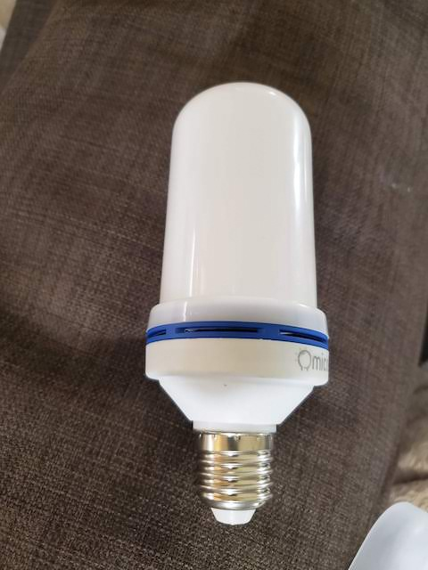
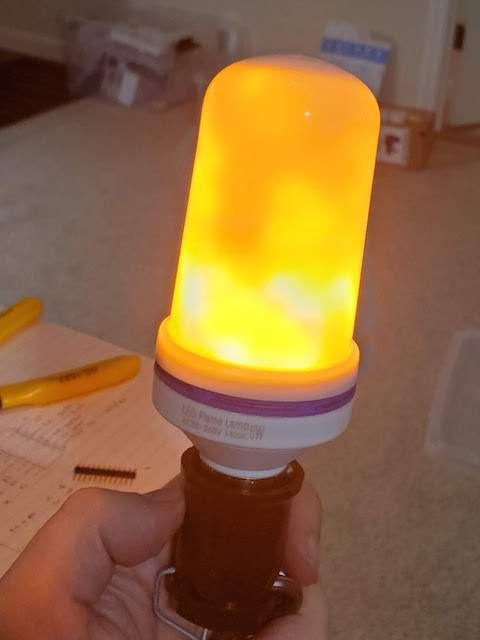

Opening it, reveals a flexible PCB that is held closed by three solder points (not seen on this picture). There is a power supply inside the lamp base, and a low-voltage cable leading up to the PCB.

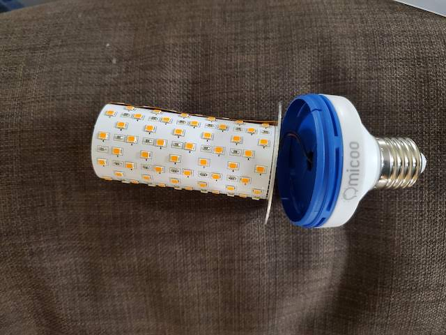

Opening up the three solder points and taking the PCB, reveals that the PCB is organized with a matrix of LEDs, and a controller and drivers on the left side:

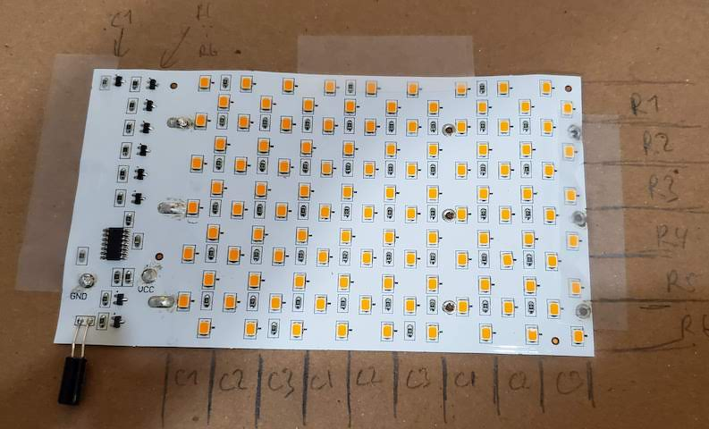

Also seen on the bottom left, is a tilt switch that ensures the flame effect is always "right side up" regardless of whether the bulb is mounted standing-up or hanging-down. Note this tilt sensor, which is shown with straight legs on this picture, is normally "wrapped around" the PCB so its signal is reversed.

A bit of measuring and experimenting, shows that the LEDs are organied as follows:

  - There is a total of 108 LEDs
  - Always, two diagonnaly adjacent LEDs form one "pixel"
  - There are six rows, and
  - there are is a total of nine columns, but only three of them are individually
    addressable -- then they repeat. So it is "Column 1", "Column 2", "Column 3",
    "Column 1", "Column 2", "Column 3", ...

The following picture illustrates that:

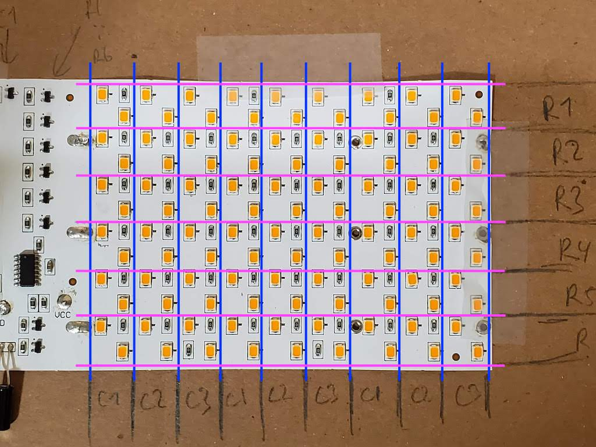

A different way of looking at this, is that out of the 108 LEDs, groups of six are individually addressable. For example, bringing up Column 2, Row 3, results in:

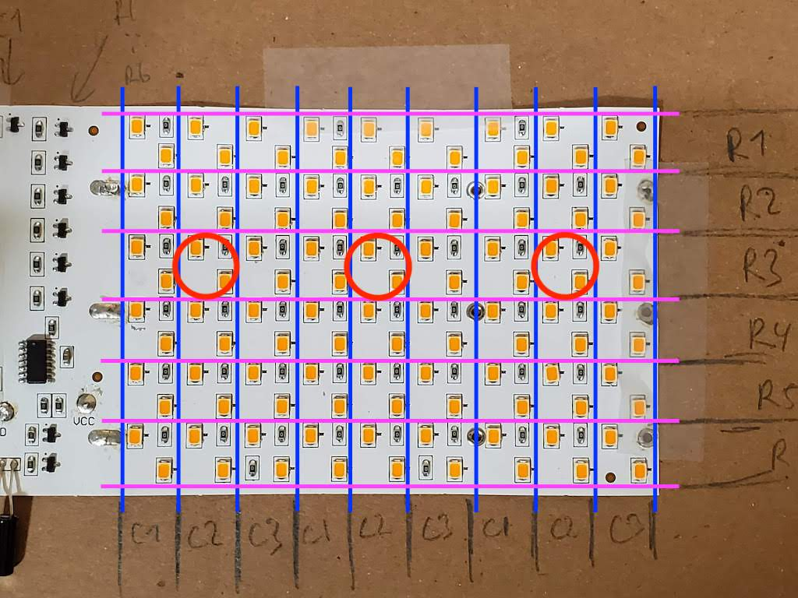

### Original controller

The IC on the left side appears to have the following function:

 - Generate a flame-like effect, where output pins are controlled such that LEDs
   appear to flicker in a flame-like pattern.

     - This is taking the reading of the tilt sensor into account, to make sure
       the flame always appears right-side-up

 - When disconnected from power for a brief period of time and then re-conneced,
   switch into a mode where all LEDs are pulsing from all-off to all-on and back

 - When again disconnected from power for a brief period of time and then re-conneced,
   switch nto a mode where all LEDs are on

Immediately to the right of the IC is a capacitor; that capacitor is responsible for
enabling that mode switch by short power interruption. It carries enough residual charge to allow the controller to "detect" that it has been connected to power previously.
Leaving the bulb powered off for more than a few seconds, will drain the capacitor and
the unit will start again in mode 1.

### Replacing the controller

In the following exercise,

  - The controller is removed from the PCB,
  - The afore-mentioned capacitor is removed from the PCB:

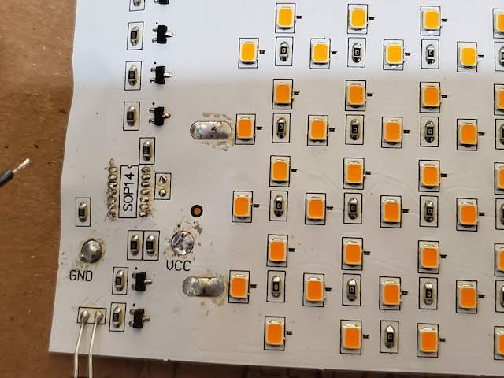

Then, the controller outputs (towards the LED drivers) and tilt switch input, as well as GND and VCC, are attached to wires that will eventually connect to the Huzzah32:

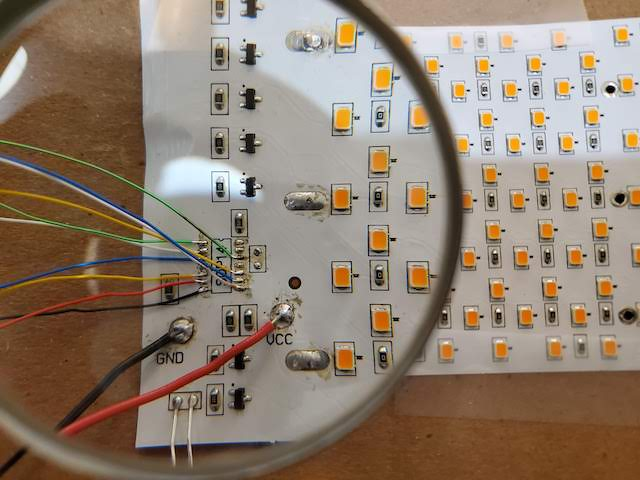

Following shows the huzzah32 connected:

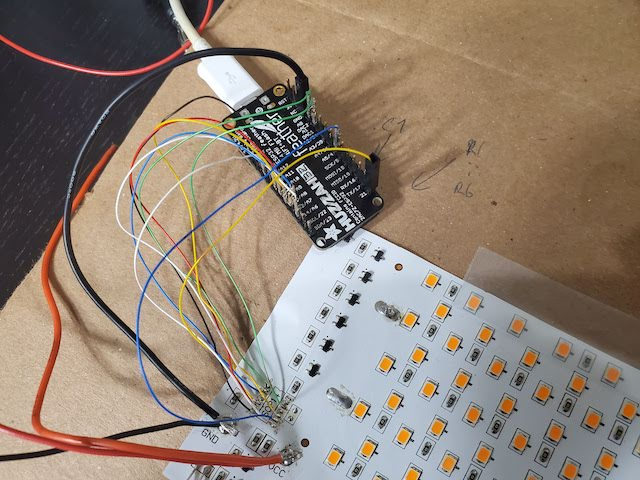

Notice that in the above picture, VCC is still not connected between the Huzzah32
board and the bulb's PCB. The power supply powering the PCB, is a lab/bench supply.
This allows for the bulk of testing and programming -- prior to proceeding, the
software should (at least) be in a state where all GPIO pins are tested, the ESP32 connects to the network, and further updates can be done OTA.

A slightly tidyer version with the wires tucked away inside a sleeve, and the lamp base now connected. Notice how the VCC wire is kept detachable, in case a USB connection
to the ESP32 is ever required for recovery:

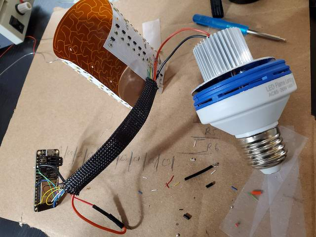

And all rolled up again, and the PCB solder points closed:

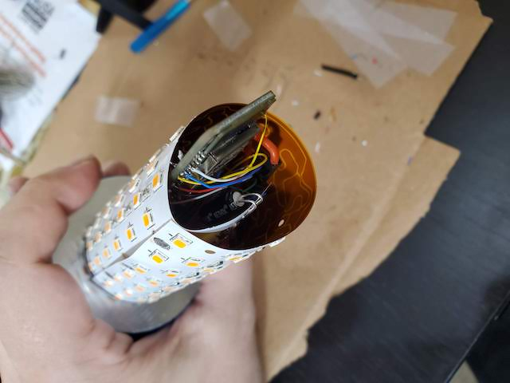

Notice the tilt switch tucked inside the rolled-up PCB again, and the Huzzah32's
antenna end slightly sticking out. This is to faclitate pulling it out if needed,
and also in an attempt to improve WiFi receive signal quality by having the antenna
(or at least part of it) outside of that roll of copper around it.

## Software

First and foremost, it should be noted that since we've removed the original flame
controller, and now have a microcontroller that is directly driving the LEDs, we
need to reproduce out intended flame effect in software. However the original controller
was driving the LEDs to create the flame effect, the new controller shares nothing
with that.

A few software considerations to take into account:

### Matrix output

As established in the hardware section, we have three GPIO pins to control the
three columns, and we have six GPI pins to control the six rows.

In the original setup, a column GPIO pin needs to be HI, and a row GPIO pin nees to
be LO, for a pixel to illuminate. We're going to reverse the row GPIOs in software,
so that both a column and a row need to be HI to bring up that pixel.

Further, we're going to attach a PWM channel to each row.

The tilt switch switches between a LO and floating input signal, so it needs
to be configured with an internal Pull-Up resistor.

In order to be able to address the pixels individually, we will do some form of
Time-Division-Multiplexing (TDM) between the rows. The software is going to drive
output using the following logic:

 1. All "column" pins to LO - this will switch off all LEDs
 1. "In the dark", set the six row outputs to their desired PWM output value
    for column 1
 1. Bring the "column 1" pin to HI -- Column 1 will now have its LEDs illumnated
    at their respective brightness (each row controlled by their respective PWM
    channel)
 1. Let the output dwell (ie. "sleep") for some amount of time
 1. All "column" pins to LO again - this will switch off all LEDs
 1. "In the dark", set the six row outputs to their desired PWM output value
    for column 2
 1. Bring the "column 2" pin to HI -- Column 2 will now have its LEDs illumnated
    at their respective brightness (each row controlled by their respective PWM
    channel)
 1. Let the output dwell (ie. "sleep") for some amount of time
 1. All "column" pins to LO again - this will switch off all LEDs
 1. Repeat the previous four steps for column 3
 1. Rinse and repeat all steps, in an infinite loop

If we cycle through this fast enough, then to the human eye this will look like
all LEDs are on at the same time.

The "dwell time" chosen in this software is 3 Milliseconds, meaning it will take
nine milliseconds to complete one "rotation" (all three columns). That gives us
a frequency of around 111 "rotations" per second -- more than enough to make
this process invisible to the eye, and produce a steady-looking output.

Note that internally, each column is only on 33% of the time (even less, considering
processing overhead), and this limits the overall intensity of each LED to
approximatly 30% of what the LED could deliver if it were "full on". For the flame
effect, that is more than enough, and it is actually a good thing as it helps to
limit power consumption.

**Bringing all LEDs up at the same time, would significantly exceed the rated power
consumption for this bulb (and therefore, likely what the power supply can
deliver)**. Even given the current TDM logic, we need to be careful to not
costantly bring an entire column to 100%.

### Creating a flame

The above bullet subsection, is enough to provide a stable-looking LED output. Of course, trying to produce a flame effect, means we need to alter the output pattern in a flame-looking way. To do this, we operate in a couple of loops:

 1. Produce a desired output pattern. We create a random patten where each
    pixel has a certain probabilty of coming on -- and in an attempt to emulate
    a flame, lower pixels have a significantly higher probability of being on than
    the higher ones.

    The following could be such a randomly created pattern:

    |    | C1 | C2 | C3 |                                                        |
    |----|----|----|----|--------------------------------------------------------|
    | R6 | X  |    |    | <--  5% probability of each pixel being on in this row |
    | R5 |    |    |    | <-- 10% probability of each pixel being on in this row |
    | R4 |    |  X |    | <-- 20% probability of each pixel being on in this row |
    | R3 | X  |    |  X | <-- 50% probability of each pixel being on in this row |
    | R2 | X  |  X |    | <-- 80% probability of each pixel being on in this row |
    | R1 | X  |  X |  X | <-- 90% probability of each pixel being on in this row |

 1. Once the target pattern is randomly decided (for whatever meaning of "random"
    there is on a microcontroller), cross-fade from the current state to the new
    desired state in 16 steps. In PWM dimming terms, going from 0 to 255, or from
    255 to 0, in 16 steps, means going increments of 16.

    Of course, it is possible that a pixel was on in the old state and is on in the
    new state, in which case there is no fade for that pixel. Same if the pixel was
    off in both states.

    Keeping in mind that one "rotation" took nine milliseconds, the entire fade
    sequence now takes 9*16=144 milliseconds. That means our flame changes
    shape 1000/144=~7 times per second.

It should be noted that the flame produced by this loop, is arguably not as nice as the flame effect produced by the original controller.

But hey, it is software now, so it can easily be improved. And it was good enough for the job this was intended to do.

### DMX control

Right, there was something... the whole exercise started because we needed to control the flame from a lighting board.

This is implemented using  E1.31(sACN) library.

There's a million better ways to do this, but currently, the bulb connects to a list of WiFi networks (SSID + Password) that are hardcoded in an include file, receives an IP address via DHCP, and listens on a E1.31 DMX universe and address that are again hard-coded.

It'd be possible to do a ton of things here: The bulb could try to connect a network, and if none successful, open its own Access Point and present a configuration interface. There's pretty much ready-to-use Arduino libraries for that purpose. DMX universe and address could be configurable. I just didn't have time for that.

The bulb currently consumes a single DMX channel, and that is master intensity. Any
intensity computed by the previously mentioned algorithm, is multplied by that master intensity. If the master intensity is 0, then all columns are set to LO and the main loop is suppressed; this avoids some residual low-intensity flicker that would otherwise still be noticable.
